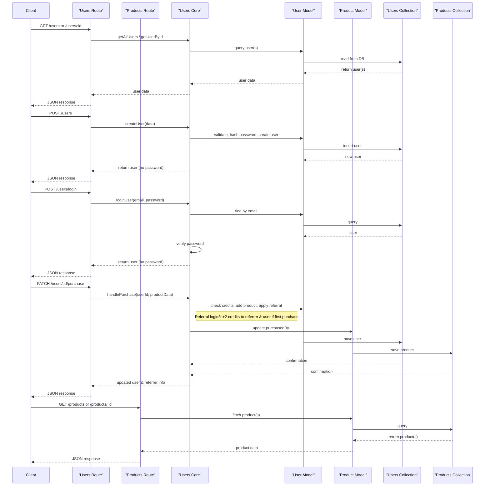

# 📚 **BookHeaven — Referral-Based Digital Bookstore** 🚀

Welcome to **BookHeaven**, a modern, minimal full-stack web app where users can **buy books using credits**, **earn rewards through referrals**, and **manage purchases** — all through a sleek and responsive UI.

## 🌐 Live URLs
- **Frontend:** [bookheavenn.vercel.app](https://bookheavenn.vercel.app)
- **Backend API:** [bookshop-backend-api.vercel.app/api](https://bookshop-backend-api.vercel.app/api)  

## 🔑 **Core Features**
- 👤 **User Authentication** – Secure signup and login.
- 🎁 **Referral System** – Earn 2 credits each for referrer & referred on first purchase.
- 💰 **Credit-Based Purchases** – Buy books using credits.
- 📚 **Book Store** – Browse and explore books.
- 🧾 **User Dashboard** – Track credits, referred users, and purchases.
- 🧠 **Core Logic** – Automatic credit deduction and referral bonuses.

## 🧩 **Tech Stack**
| Area               | Technology                                          |
| ------------------ | --------------------------------------------------- |
| **Frontend**       | Next.js · TypeScript · Tailwind CSS · Shadcn/UI     |
| **Backend**        | Node.js · TypeScript · Express · MongoDB (Mongoose) |
| **Authentication** | Custom auth system                                  |
| **Deployment**     | Vercel                                              |

## 🚀 **Getting Started**
### Frontend
```bash
cd frontend
pnpm install
pnpm run dev
````

* Local URL: [http://localhost:3000](http://localhost:3000)

### Backend

```bash
cd backend
cp .env.example .env
pnpm install
pnpm run dev
```

* Local URL: [http://localhost:5000](http://localhost:5000)

---

## 🔗 **API Endpoints**

### 👤 `/api/users`

| Method    | Endpoint              | Description                         |
| --------- | --------------------- | ----------------------------------- |
| **GET**   | `/users`              | Get all users                       |
| **GET**   | `/users/:id`          | Get a user by ID                    |
| **POST**  | `/users`              | Register a new user                 |
| **POST**  | `/users/login`        | Log in a user                       |
| **PATCH** | `/users/:id/purchase` | Handle purchases & referral rewards |

### 📘 `/api/products`

| Method  | Endpoint        | Description              |
| ------- | --------------- | ------------------------ |
| **GET** | `/products`     | Fetch all books          |
| **GET** | `/products/:id` | Fetch book details by ID |

---


